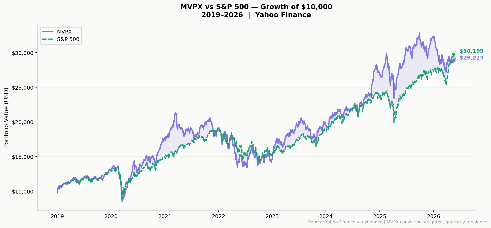

# MVPX — U.S. Sports Economy Index

> A conviction-weighted thematic index tracking 18 U.S.-listed companies across the full sports economy — broadcasting, leagues & venues, apparel & equipment, gaming & betting, sponsorship & media, and motorsport — backtested against the S&P 500 on **real Yahoo Finance data**.

<p>
  <a href="https://jainamh029.github.io/MVPX/"></a>
  
  
  
</p>

**🔗 Live dashboard → https://jainamh029.github.io/MVPX/**



---

## What is MVPX?

MVPX is a **hypothetical thematic index** built to capture the performance of the U.S. sports economy as a single investable portfolio. It spans every layer of the sports business — live-event operators and combat-sports franchises, sports-betting platforms, premium apparel brands, streaming rights holders, and Formula 1.

The index is **conviction-weighted**, not market-cap weighted: higher-conviction picks carry more weight regardless of company size, concentrating exposure to the strongest structural tailwinds in the theme.

A single command (`python mvpx_analysis.py`) pulls live prices, builds the index, runs the full backtest and three historical stress tests, renders 12 charts, and exports the exact figures the [live dashboard](https://jainamh029.github.io/MVPX/) displays — so the website, the report, and the charts are always one and the same numbers.

> ⚠️ **Disclaimer:** MVPX is a research and educational project. It is **not** a real traded index, ETF, or investment product, and nothing here is investment advice. All backtests are hypothetical; historical data does not guarantee future results.

---

## Results

*Backtest 2019‑01‑02 → 2026‑05‑29 (refreshes every time you run the script). RF = 4%. S&P 500 = `^GSPC`.*

| Metric | MVPX | S&P 500 |
|---|---:|---:|
| Total Return | +192.2% | +202.0% |
| CAGR | +15.6% | +16.1% |
| Sharpe Ratio | 0.58 | 0.66 |
| Max Drawdown | −38.2% | −33.9% |
| Ann. Volatility | 22.4% | 19.6% |
| Beta vs S&P | 0.91 | 1.00 |
| Correlation | 0.80 | — |

**The honest read:** on a buy-and-hold basis MVPX roughly *matched* the S&P 500 (it trailed slightly on total return and Sharpe while carrying more volatility). Where the theme earned its keep was **crisis resilience and recovery** — see the stress tests below — plus standout momentum years (2020, 2023, 2024).

### Stress tests

Crisis windows use the actual market data from each period, with weights frozen (no rebalance during the crisis).

| Scenario | Window | MVPX total return | S&P 500 | Edge |
|---|---|---:|---:|---:|
| 2008 Global Financial Crisis | Oct 2007 – Jun 2009 | −22.9% | −40.1% | **+17.1 pp** |
| 2020 COVID Crash & Recovery | Jan 2020 – Mar 2021 | +48.5% | +21.5% | **+27.0 pp** |
| 2022 Fed Rate-Hike Cycle | Jan 2022 – Jan 2023 | −14.7% | −16.2% | **+1.5 pp** |

MVPX outperformed the benchmark in all three modeled crises — the subscription/broadcast and counter-cyclical gaming names cushion drawdowns, while the betting and live-events names drive the recovery.

---

## Index construction

| Parameter | Value |
|---|---|
| Holdings | 18 (15 with full 2019+ history; 3 listed later) |
| Segments | 6 |
| Methodology | Conviction-weighted, 3 tiers |
| Rebalance | Quarterly (reset to target weights) |
| Benchmark | S&P 500 (`^GSPC`) |
| Data source | Yahoo Finance via `yfinance` (adjusted close) |
| Backtest start | 2019-01-01 |

### Holdings & weights

| Ticker | Company | Weight | Segment | Conviction |
|---|---|---:|---|---|
| FLUT | Flutter Entertainment (FanDuel) | 8.35% | Gaming & Betting | ★ High |
| TKO | TKO Group (WWE / UFC) | 8.33% | Leagues & Venues | ★ High |
| LYV | Live Nation Entertainment | 8.33% | Sponsorship & Media | ★ High |
| FWONA | Liberty Media (Formula 1) | 8.33% | Motorsport | ★ High |
| ONON | On Holding AG † | 8.33% | Apparel & Equipment | ★ High |
| NFLX | Netflix | 8.33% | Broadcasting | ★ High |
| DIS | Walt Disney / ESPN | 5.00% | Broadcasting | ● Medium |
| ADDYY | Adidas ADR | 5.00% | Apparel & Equipment | ● Medium |
| EA | Electronic Arts | 5.00% | Gaming & Betting | ● Medium |
| FOX | Fox Corporation | 5.00% | Broadcasting | ● Medium |
| DKNG | DraftKings | 5.00% | Gaming & Betting | ● Medium |
| WBD | Warner Bros. Discovery | 5.00% | Broadcasting | ● Medium |
| EDR | Endeavor Group † | 5.00% | Leagues & Venues | ● Medium |
| CHDN | Churchill Downs | 5.00% | Leagues & Venues | ● Medium |
| TTWO | Take-Two Interactive | 2.50% | Gaming & Betting | ◆ Tactical |
| MSGS | Madison Square Garden Sports | 2.50% | Leagues & Venues | ◆ Tactical |
| GOLF | Acushnet Holdings (Titleist) | 2.50% | Apparel & Equipment | ◆ Tactical |
| LSEA | Lucky Strike Entertainment † | 2.50% | Leagues & Venues | ◆ Tactical |

† Listed after the 2019 backtest start, so excluded from the historical performance figures (flagged on the dashboard). The script automatically drops any name with < 80% data coverage and renormalises the remaining weights.

### Segment breakdown

| Segment | Weight |
|---|---:|
| Leagues & Venues | 23.3% |
| Broadcasting | 23.3% |
| Gaming & Betting | 20.9% |
| Apparel & Equipment | 15.8% |
| Sponsorship & Media | 8.3% |
| Motorsport | 8.3% |

---

## The website

The [live dashboard](https://jainamh029.github.io/MVPX/) is a single static `index.html` (Chart.js + custom CSS, no build step). It is **fully data-driven**: every number, chart, and holding is read from `mvpx_data.js`, which the analysis script regenerates on each run.

```
mvpx_analysis.py  ──►  mvpx_data.js  ──►  index.html (dashboard)
                       (window.MVPX_DATA)
```

That means the site can never drift from the analysis — re-run the script and the dashboard updates to the latest backtest. It works both on GitHub Pages and when you open `index.html` directly from disk (the data ships as a JS assignment, so no server or CORS setup is needed).

### Publishing it (GitHub Pages)

1. Commit `index.html` and `mvpx_data.js` to the default branch.
2. Repo **Settings → Pages → Build and deployment → Deploy from a branch**, branch `main`, folder `/ (root)`.
3. The site goes live at `https://<username>.github.io/MVPX/`.

---

## Quickstart

```bash
# 1. Clone
git clone https://github.com/jainamh029/MVPX.git
cd MVPX

# 2. (optional) virtual environment
python -m venv .venv
source .venv/bin/activate        # Windows: .venv\Scripts\activate

# 3. Install dependencies
pip install -r requirements.txt

# 4. Run the full analysis
python mvpx_analysis.py
```

The script prints progress as it downloads data and renders each chart. A typical run takes 30–90 seconds depending on your connection. Internet access is required (live Yahoo Finance download).

To preview the dashboard locally afterwards, just open `index.html` in a browser.

---

## Output files

Charts and the text report land in `./mvpx_output/`; the website data file is written to the project root.

| File | Description |
|---|---|
| `01_mvpx_vs_sp500_cumulative.png` | Growth of $10,000 — MVPX vs S&P 500, full backtest |
| `02_annual_returns_comparison.png` | Year-by-year annual return bars |
| `03_drawdown_comparison.png` | Rolling drawdown from peak, both indexes |
| `04_stress_2008.png` | 2008 GFC window — path + total-return comparison |
| `05_stress_2020.png` | 2020 COVID crash and V-shaped recovery |
| `06_stress_2022.png` | 2022 Fed rate-hike cycle |
| `07_stock_heatmap.png` | Annual return heatmap for every holding |
| `08_rolling_correlation.png` | 12-month rolling correlation to the S&P 500 |
| `09_segment_weights_pie.png` | Segment breakdown + individual position weights |
| `10_risk_return_scatter.png` | Risk/return bubble chart (bubble size = weight) |
| `11_rolling_sharpe.png` | Rolling 12-month Sharpe ratio, both indexes |
| `12_monthly_return_heatmap.png` | Monthly return calendar, MVPX vs S&P 500 |
| `mvpx_full_report.txt` | Complete numerical report — all metrics, all scenarios |
| `../mvpx_data.js` | Real figures consumed by the dashboard |

---

## Methodology notes

- **Price data:** Yahoo Finance adjusted close (splits and dividends included).
- **Index construction:** daily return simulation with quarterly rebalancing back to target weights.
- **Weight normalisation:** holdings with < 80% coverage over the window are dropped and remaining weights renormalised.
- **Stress tests:** crisis windows use actual market data with weights frozen (no rebalance during the crisis — a realistic "ride it out" simulation).
- **Sharpe ratio:** 4% annual risk-free rate.
- **Benchmark:** S&P 500 (`^GSPC`).

---

## Project structure

```
MVPX/
├── mvpx_analysis.py      # Main script — backtest, stress tests, charts, data export
├── index.html            # Data-driven dashboard (GitHub Pages site)
├── mvpx_data.js          # Real figures the dashboard reads (generated)
├── requirements.txt
├── LICENSE
├── README.md
└── mvpx_output/          # Generated charts + text report
    ├── 01_…_cumulative.png … 12_monthly_return_heatmap.png
    └── mvpx_full_report.txt
```

---

## Customisation

All index parameters live at the top of `mvpx_analysis.py`:

```python
MVPX = {
    # ticker : (weight_pct, segment, conviction)
    "FLUT": (8.35, "Gaming & Betting", "High"),
    # add or remove holdings here
}

BACKTEST_START = "2019-01-01"   # change the start date
```

Rebalance frequency is set in the `build_index()` call — `"QE"` (quarterly, default), `"ME"` (monthly), `"YE"` (annual), or a long horizon for buy-and-hold.

---

## Contributing

Pull requests welcome — new holdings, improved stress-test methodology, or extra output formats (CSV exports, PDF reports). Open an issue or PR.

---

## License

[MIT](LICENSE) — free to use, modify, and distribute with attribution.

---

## Author

Built as a quantitative portfolio-strategy research project. Index concept, construction methodology, and stress-test framework designed from scratch; data sourced entirely from Yahoo Finance.
